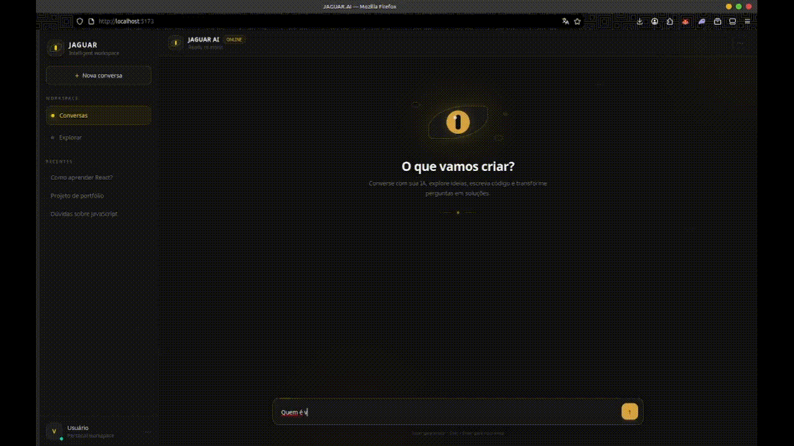

# JAGUAR.AI

### AI-powered organizational intelligence workspace

JAGUAR.AI é um workspace inteligente baseado em IA, desenvolvido para centralizar conversas, conhecimento, documentos e, futuramente, dados organizacionais em um único ambiente.

A proposta do Jaguar é evoluir de um assistente conversacional para uma camada de inteligência capaz de interagir com o conhecimento e os sistemas de uma organização.

## 🚀 Demo

## ✨ Features

- ✓ Conversational AI
- ✓ Groq API
- ✓ Markdown
- ✓ Code Blocks
- ✓ Syntax Highlight
- ✓ Copy to clipboard
- ✓ Nova conversa
- ✓ Workspace com navegação por seções
- ✓ Base de Conhecimento
- ✓ Organização de documentos e categorias
- ✓ Interface preparada para dados organizacionais

## 🧠 Visão

O Jaguar não foi projetado apenas como um chatbot.

A visão do projeto é criar uma camada de inteligência organizacional capaz de conectar:

- Conversas
- Documentos
- Conhecimento
- Dados
- Usuários
- Sistemas externos
- Analytics

O objetivo é permitir que uma organização consulte suas próprias informações através de uma interface conversacional inteligente.

## 📊 Jaguar + Nexus

O Jaguar também está sendo projetado para integrar-se ao **Nexus**, uma plataforma de Analytics que está evoluindo de um dashboard focado em YouTube para uma solução completa de visualização e análise de dados empresariais.

A divisão de responsabilidades será:

**Jaguar**
- Inteligência
- Conversação
- Contexto
- Conhecimento organizacional
- Interpretação de dados

**Nexus**
- Dashboards
- Gráficos
- KPIs
- Métricas
- Análise detalhada

A integração permitirá que o Jaguar consulte informações disponibilizadas pelo Nexus e apresente esses dados de forma contextualizada ao usuário.

> **Jaguar entende. Nexus mostra. A empresa decide.**

## 🛠️ Stack

### Frontend
- React
- Vite
- Tailwind CSS
- JavaScript

### Backend
- Node.js
- Express

### AI
- Groq API

### Planejado
- MySQL
- Prisma
- Authentication
- Multi-tenant
- Knowledge Base
- Semantic Search
- RAG
- Nexus API Integration

## 🗺️ Roadmap

- [x] Conversational AI
- [x] Groq API
- [x] Markdown
- [x] Code Blocks
- [x] Syntax Highlight
- [x] Copy to clipboard
- [x] Nova conversa
- [x] Workspace structure
- [x] Base de Conhecimento interface
- [ ] MySQL + Prisma
- [ ] Histórico persistente
- [ ] Authentication
- [ ] Multi-tenant
- [ ] Document processing
- [ ] Semantic Search
- [ ] RAG
- [ ] Nexus API Integration
- [ ] Organizational data layer

## 🎯 Long-term Vision

Transformar o JAGUAR.AI em uma plataforma de inteligência organizacional capaz de conectar pessoas, conhecimento, documentos e dados em um único workspace inteligente.

---

